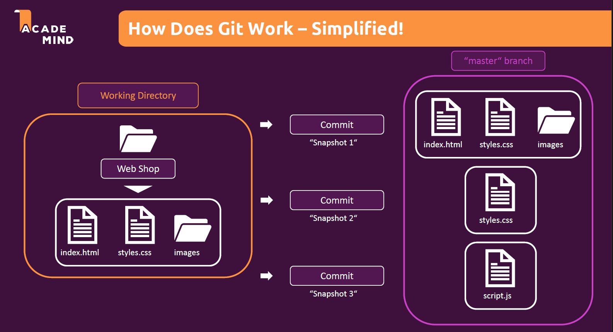
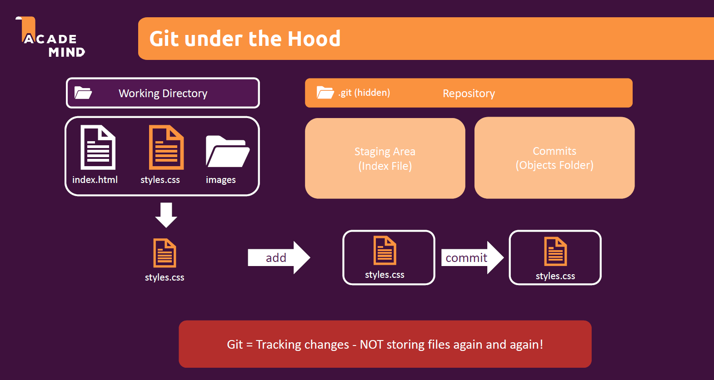
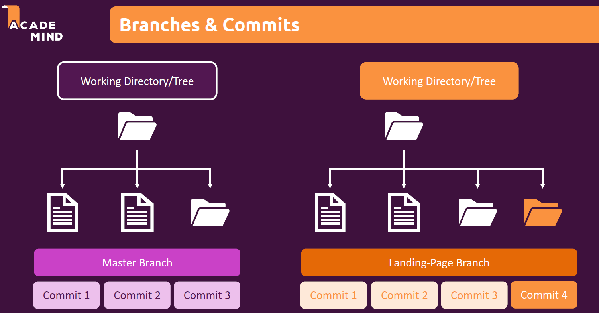

# git-the-practical-guide

Git is all about control and tracking of code changes over time. It is highly efficient version management system. Some of the major pros of the git are:

<ol>
<li>Version Control System</li>
<li>Manage Code History</li>
<li>Track Changes</li>
</ol>

Git is local and hence we can't collaborate with others. Github is where companies build software. 

<ol>
<li>Largest Development Platform</li>
<li>Cloud Hosting & Collaboration Provider</li>
<li>Git Repository Hosting</li>
</ol>

<h2><a id="index">Index</a></h2>

[1. Command Line](#commandline)

[2. Windows Command Prompt Basics](#windowscommandprompt)

[3. Git Version Management](#versionmanagement)

[4. Branches](#branches)

<h2><a id="commandline">1. Command Line</a></h2>

Some of the key things that can be done with command prompt (but not with GUI) are:
<ul>
<li>Start servers (web development)</li>
<li>Download + Install Tools</li>
<li>Run Code</li>
<li>Execute Files</li>
<li>Working with Git</li>
</ul>

On windows, we can interact with computer directly either using Command Prompt or PowerShell.

<h2><a id="windowscommandprompt">2. Windows Command Prompt Basics</a></h2>

Windows command prompt details can be found [here](https://docs.microsoft.com/en-us/windows-server/administration/windows-commands/windows-commands). Windows new PowerShell commands can be found [here](https://docs.microsoft.com/en-us/powershell/scripting/overview?view=powershell-7)

<ol>
<li>dir: List all the directories in the current directory</li>
<li>cd {dir}: Changes to mentioned directory</li>
<li>cd ..: Go back one level in directory</li>
<li>To change the drive (say from C: to D:) type D:</li>
<li>Relative Paths: start from current directory. For example "CD Users" moves to Users folder.</li>
<li>Absolute Paths: Starts from the root directory to the final folder. Just type "CD {full absolute path}".</li>
<li>cls: Clear command prompt</li>
<li>mkdir {foldername}: creates a folder in current directory.</li>
<li>echo {content} > {filename}.txt: createas a text file.</li>
<li>del {filename}: deletes the file</li>
<li>del {folder name}: deletes the folder.</li>
<li>copy {filename} {foldername}: copies {filename} from current directory to {foldername}</li>
<li>move {filename} {foldername}: moves {filename} from current directory to {foldername}</li>
<li>Same as above we can move the folders.</li>
</ol>

<h2><a id="versionmanagement">3. Git Version Management</a></h2>

By default git saves all changes made to the main branch. .git (hidden folder) is the repository. There are two areas: Staging Area (Index File) and Commits (Objects Folder). Staging area is a draft area which contains the changes to repositary. GIT means "tracking changes - not storing files again and again!". It only track the changes in the file. 

<h2><a id="branches">4. Branches</a></h2>
Initially all the files are stores in the 'main' branch. Its the core folder that contains the running code. Let's say we want to add new functionality. If we keep working on the main branch, it might end up breaking the working code, if the new added code is not working as intended. Hence, we do branching. With branching, we can create a exact copy and implement new functionality in that. Once3 tested, the new features can be merged with the "main" branch. This allows developers to work on independent features and then bring together all the work into the "main" branch.

<h2></h2>
 
