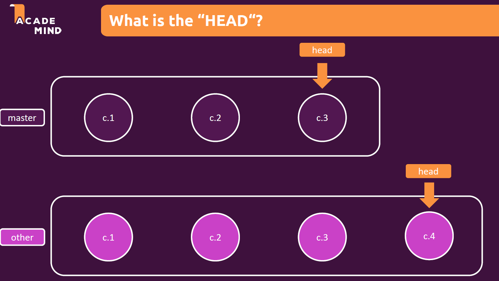

# Git - Practial Guide

Git is all about control and tracking of code changes over time. It is highly efficient version management system. Some of the major pros of the git are:

[Git commands reference](https://git-scm.com/docs)

[Official Git Website](https://git-scm.com/)

<ol>
<li>Version Control System</li>
<li>Manage Code History</li>
<li>Track Changes</li>
</ol>

Git is local and hence we can't collaborate with others. Github is where companies build software. 

<ol>
<li>Largest Development Platform</li>
<li>Cloud Hosting & Collaboration Provider</li>
<li>Git Repository Hosting</li>
</ol>

<h2><a id="index">Index</a></h2>

[1. Command Line](#commandline) 
[2. Windows Command Prompt Basics](#windowscommandprompt) 
[3. Git Version Management](#versionmanagement) 
[4. Branches](#branches) 
[5. Head](#head) 
[6. .gitignore](#gitignore) 
[7. Git Stash](#gitstash) 
[8. Git Reflog](#gitreflog) 
[9. Combining Main and Feature Branches](#combiningbranches) 
[10. Rebase](#gitrebase) 
[11. Handling Merge Conflicts](#mergeconflicts) 
[12. Merge - Rebase - Cherry Picking](#mergerebasecherrypick) 
[13. Git Tags](#gittags) 
[14. Github Basics](#githubbasics) 
[15. Git Clone](#gitclone) 
[16. Github Projects](#githubprojects) 

<h2><a id="commandline">1. Command Line</a></h2>

Some of the key things that can be done with command prompt (but not with GUI) are:
<ul>
<li>Start servers (web development)</li>
<li>Download + Install Tools</li>
<li>Run Code</li>
<li>Execute Files</li>
<li>Working with Git</li>
</ul>

On windows, we can interact with computer directly either using Command Prompt or PowerShell.

<h2><a id="windowscommandprompt">2. Windows Command Prompt Basics</a></h2>

Windows command prompt details can be found [here](https://docs.microsoft.com/en-us/windows-server/administration/windows-commands/windows-commands). Windows new PowerShell commands can be found [here](https://docs.microsoft.com/en-us/powershell/scripting/overview?view=powershell-7)

<ol>
<li>dir: List all the directories in the current directory</li>
<li>cd {dir}: Changes to mentioned directory</li>
<li>cd ..: Go back one level in directory</li>
<li>To change the drive (say from C: to D:) type D:</li>
<li>Relative Paths: start from current directory. For example "CD Users" moves to Users folder.</li>
<li>Absolute Paths: Starts from the root directory to the final folder. Just type "CD {full absolute path}".</li>
<li>cls: Clear command prompt</li>
<li>mkdir {foldername}: creates a folder in current directory.</li>
<li>echo {content} > {filename}.txt: createas a text file.</li>
<li>del {filename}: deletes the file</li>
<li>del {folder name}: deletes the folder.</li>
<li>copy {filename} {foldername}: copies {filename} from current directory to {foldername}</li>
<li>move {filename} {foldername}: moves {filename} from current directory to {foldername}</li>
<li>Same as above we can move the folders.</li>
</ol>

<h2><a id="versionmanagement">3. Git Version Management</a></h2>

By default git saves all changes made to the main branch. .git (hidden folder) is the repository. There are two areas: Staging Area (Index File) and Commits (Objects Folder). Staging area is a draft area which contains the changes to repositary. GIT means "tracking changes - not storing files again and again!". It only track the changes in the file. 

<h2><a id="branches">4. Branches</a></h2>
Initially all the files are stores in the 'main' branch. Its the core folder that contains the running code. Let's say we want to add new functionality. If we keep working on the main branch, it might end up breaking the working code, if the new added code is not working as intended. Hence, we do branching. With branching, we can create a exact copy and implement new functionality in that. Once3 tested, the new features can be merged with the "main" branch. This allows developers to work on independent features and then bring together all the work into the "main" branch.

<h2><a id="head">5. Head</a></h2>
Head points to the last commit. When we say checkout a certain commit, then the head would be reffered as detached head as this is not the head of the branch, but head at the time of that commit.

<h2><a id="gitignore">6. .gitignore</a></h2>

Cases there are files which we want to have in our project but don't want to track the versions. Here .gitignore comes in handy. It is created manually in the git repo. *.log file implies we git should ignore all files with .log extension. ALl files that needs to be ignored are added to .gitignore file. Similarly if we want to include some file which would have been skipped due to global *.log, we add !{filename}. 

Similarly to ignore the whole folder add {folder_name}/* to the .gitignore file. This will ignore all the files in the folder.

<h2><a id="gitstash">7. Git Stash</a></h2>
Stash - save uncommited and unsaved changes. Say you are working on a feature and the code is not yet complete. We could either commit the incomplete code or use git stash to save it. If we commit, we create a dirty project flow with lot of incomplete commits. Git stash however will help us save the code and not commit it right away. Once we run git stash command, our project status will go back to last commit. To get back our saved changes run the command (git stash apply). This will bring up all the saved changes back in our repo to work.

<h2><a id="gitreflog">8. Git Reflog</a></h2>
Saves changes made in last 30 days. Hence, in case we deleted something by mistake, we can recover it. It can also help recover the deleted branches. git reflog command lists out all the changes that were made in last 30 days, with a hash for each. To recover a branch:

<ul>
<ol>git checkout {hash copied from git reflog command}. This will create a detached head.</ol>
<ol>git switch -c {branchname}. Creates a new branchname with branchname and adds the detached head to it.</ol>
</ul>

<h2><a id="combiningbranches">9. Combining Main and Feature Branches</a></h2>

There are two [different types of merges](https://git-scm.com/docs/merge-strategies) in git:
<ol>
<li><b>Fast-Forward Merge</b>: It only works if there has been no commit in the main branch after we started working on the feature branch. In this case, the git will simply move the HEAD to the feature branch end but doesnot create commit.</li>
<li><b>Non Fast-Forward Merge</b>: <ol>
<li><b>Recursive Merge</b>: Here we additional commits in both main and feature branch after feature branch was created. Additional merge commit is created in main branch. Recursive merge is applied by default if two branches being merged have seen changes after they were divided for development.</li>
<li><b>Octopus Merge</b>: </li>
<li><b>Ours Merge</b>: </li>
<li><b>Subtree Merge</b>: </li>
</ol></li>
</ol>

<h2><a id="gitrebase">10. Rebase</a></h2>

This is done to move changes made in main branch to feature branch. Say we had main branch with commits m1 and m2. We created a new branch ("feature"). In that we had commits f1 and f2. At same time, we added a commit m3 to main. Rebase will move the m3 commit to feature branch, before f1 and f2 commit. Then we merge them together (fast forward merge). Rebase does not move commits. It creates new commits. Never rebase commits outside your repository. Rebase is used when:

<ol>
<li>New commits in main branch while working in feature branch.</li>
<li>Feature relies on additional commits in main branch.</li>
<li>Feature is finished - Implementation into main without merge commit.</li>
<li>Rebase main into feature branch.</li>
<li>Rebase main into feature + (fast-forward) merge feature into main.</li>
</ol>

Remember: Rebasing re-writes code history! Hence should not be used commonly.

<h2><a id="mergeconflicts">11. Handling Merge Conflicts</a></h2>
In real life, when we try to merge, there could be conflicts. This can happen when two different people work on same file. In this scenario, it always better to view the difference between conflicts and resolve this. More infor can be found [here](https://git-scm.com/book/en/v2/Git-Tools-Advanced-Merging#_advanced_merging)

<h2><a id="mergerebasecherrypick">12. Merge - Rebase - Cherry Picking</a></h2>
Cherry picking adds a specific commit to branch (HEAD). This also copes commit with new ids. Say we have multiple commits And we want to just merge one commit changes to the main branch. git-cherry-pick {hash of commit} run while being in main branch.

<h2><a id="gittags">13. Git Tags</a></h2>
Tags are used to differenciate between important stages in our code history. 
<li><b>Light Weight Tags</b>: is a pointer towards a commit in the branch. Like a branch itself.</li>
<li><b>Annotated Tags</b>: is a full object in git and contains information like email id of person who created the tag.</li>

Tags can also be used to move to certain commit or view that commit by just referring to the tag (and no need to copy paste the hash of the commit).

<h2><a id="githubbasics">14. Github Basics</a></h2>
Personal Access Token: Settings -> Developer Settings -> Personal Access Token -> Copy this token to allow pushing our local repo to remote repo. Skip the admin part and allow the token to access everything.

Remote Tracking Branch is read-only copy of the Remote Branch. Local Branch sits out in PC, Remote Branch in Cloud (hosting environment) and Remote Tracking Branch is a read only copy of Remote Branch on PC. Remote Tracking Branch is labelled as remotes/origin/main.

Types of branches:

<ol>
<li><b>Local Branch</b>: Branch on your machine only.</li>
<li><b>Remote Branch</b>: Branch in remote location (usually hosting provider).</li>
<li><b>Tracking Branch</b>: <ol>
<li><b>Remote Tracking Branch</b>: Local copy of remote branch (not to be edited). Commands available are "git fetch".</li>
<li><b>Local Tracking Branch</b>: Local reference to remote tracking branch (to be edited). Commands available are "git push" and "git pull".</li>
</ol></li>
</ol>

[14.1 Local and Remote Branches are Connected as:](#141) 
[14.2 Clone a Repository](#142) 
[14.3 Github Security](#143) 

<h3><a id="141">14.1 Local and Remote Branches are Connected as:</a></h3>

<h3><a id="142">14.2 Clone a Repository</a></h3>

<h3><a id="143">14.3 Github Security</a></h3>

Personal access token gives us access to Github via git. If a wrong person can get access to your github token, they also get access to your Github and can commit/make changes to your repo. To collaborate with users on different projects, we have owner access and collaborator access. To allow other people to contribute to your public repositary:

<ol>
<li>Go to a specific repo, and click on setting. Click on Collaborators and this will show who can contribute to the current repo. By default only the owner of the repo is able to contribute to the repo.</li>
<li>Click on Manage Access and invite a user by username, full name or email. </li>
<li>Github will then send an invite to the user. And once they accept that, they will also get push access to the repo.</li>
<li>The added user can create his own personal token. Since, the user has access to this repo (And his/her own repos), they will be able to push changes using their own personal token.</li>
</ol>

Collaborating to private repo works in the same way as public repo. Once we add a collaborator to a repo, it doesn't make difference if it is public and private repo.

Rights of Collaborators can be found [here](https://docs.github.com/en/account-and-profile/setting-up-and-managing-your-personal-account-on-github/managing-personal-account-settings/permission-levels-for-a-personal-account-repository). 

To allow limited access to a repo, follow the steps:

<ol>
<li>Go to Github Settings and click on 'Moderation' in the right hand side.</li>
<li>Here we have options to block a user, add interaction limits and add code review limits.</li>
</ol>

To make limited access changes to a repo, go to 'settings' of the repo and select the moderation settings. It works in similar way as for whole github profile.

<h2><a id="gitclone">15. Git Clone and Fork</a></h2>

Clone allows us to create a copy of public repo to our own account. This only works well when both accounts are for the same person, as there are no checks/balances on pushing new code to a cloned repo.

Fork works like this. Lets say there is a public repo (User A) on Github. We (User B) create a fork of the repo and thus end up creating a remote repo on (User B) Github.

<ol>
<li>User B then clones the remote repo to his local device.</li>
<li>User B works on local repo and make some changes.</li>
<li>User B pushes those local changes to remote repo(of User B).</li>
<li>Then User B creates a pull request, which means he asks User A to review his code and add it to the main public repo.</li>
<li>User A then reviews the changes and accepts the pull requests.</li>
<li>Then the changes are merged into remote repo.</li>
</ol>

To fork a repository, just go to a public repository and click on fork. Select the account and within few seconds, the repository should be forked. To merge the changes made in forked repo to the original repo,

<ol>
<li>Once we have pushed the changes to our repo (forked from other user).</li>
<li>Click on create pull request, and select the branches. If the merge is allowed, Github will show "Able to merge" option.</li>
<li>Add a detailed message, and click on "Create Pull Request".</li>
<li>This will send message to owner of repo. They can see the pull request and the changes made. </li>
<li>Owner can review the changes and accept the changes. They will click on review changes and leaves a feedback.</li>
<li>They can accept the request, reject the request and/or request changes in the request.</li>
</ol>

<h2><a id="githubprojects">16. Github Projects</a></h2>

Issues can be added to projects. A single repo can have multiple projects. We can also select kanban board to track progress of the project. The updating of kanban board can also be automated.

Github stars - are likes in the world of instagram/facebook. Stars usually gives popularity of the repo.